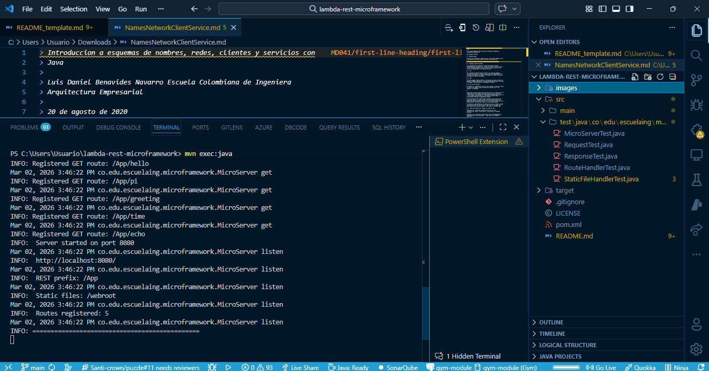
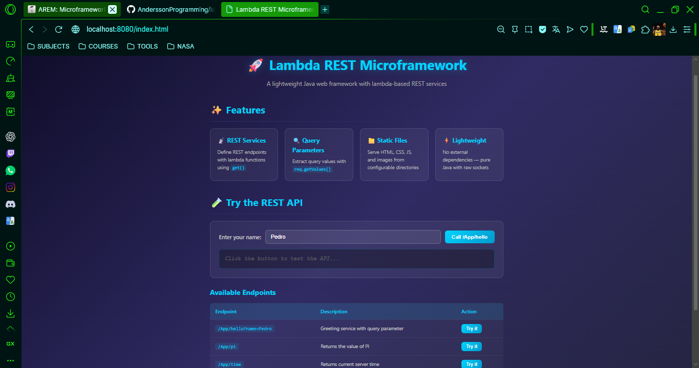
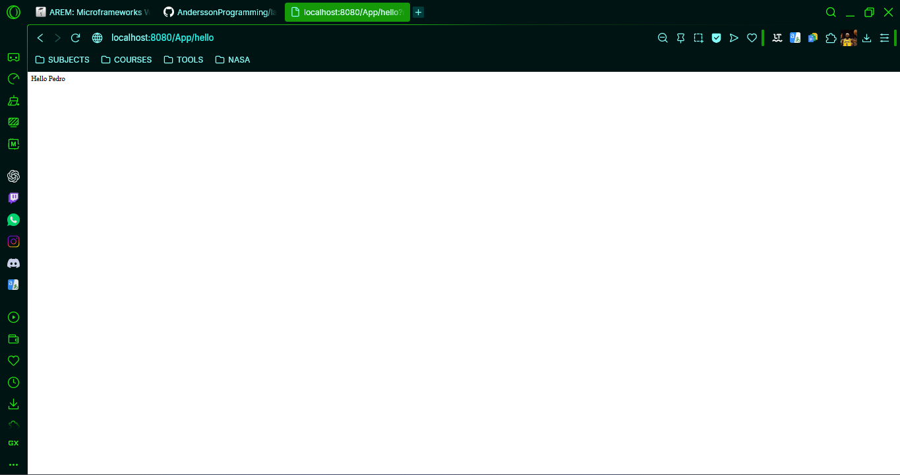
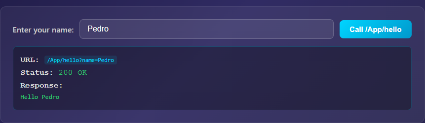
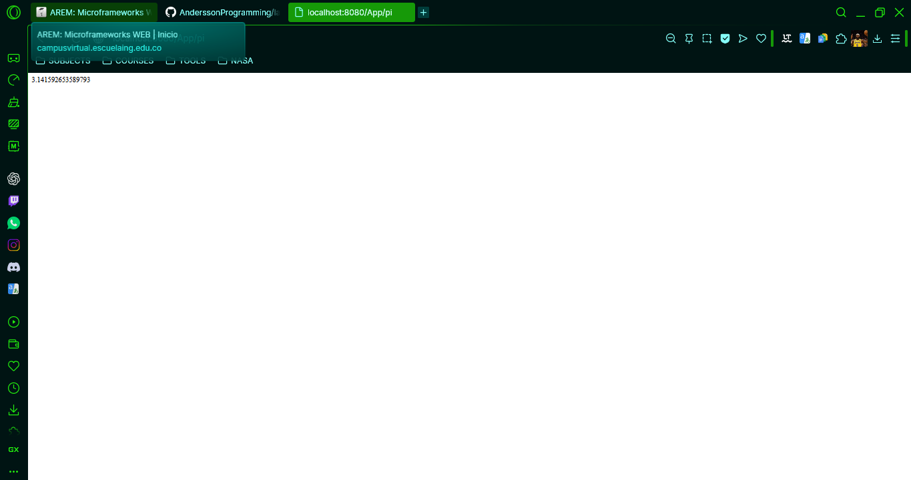
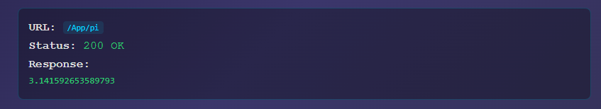
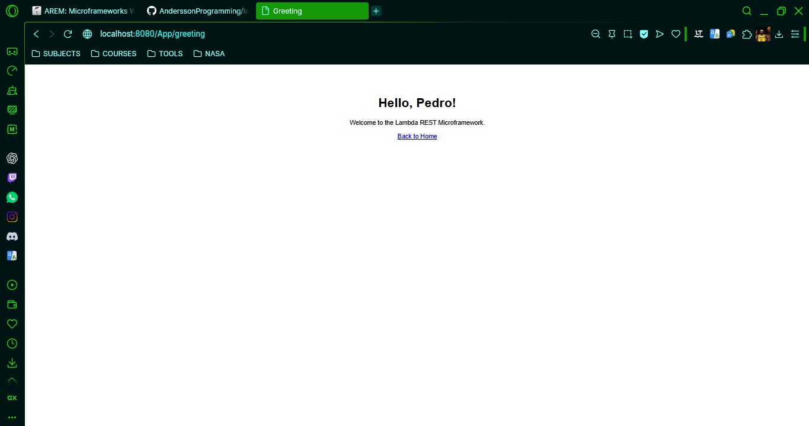
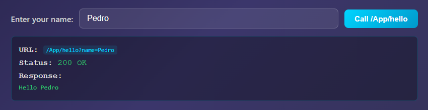
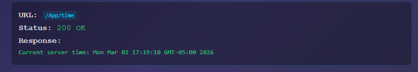
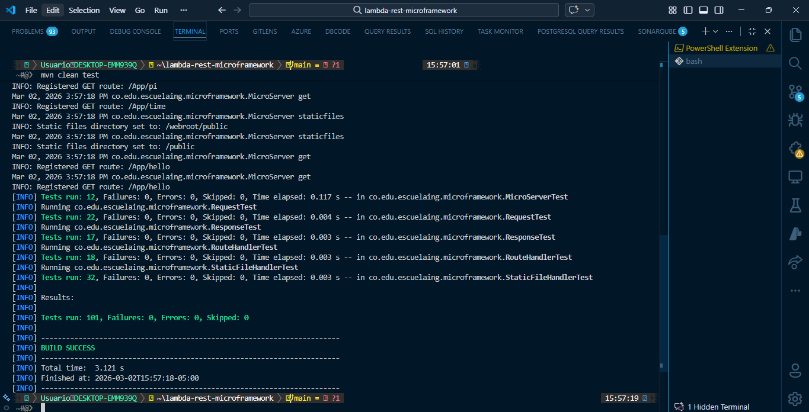

# ⚡ Lambda REST Microframework

> A lightweight **Java web microframework** that enables developers to build REST services using **lambda functions**, extract query parameters, and serve static files — all powered by raw Java sockets with **zero external dependencies**.


## 📸 Screenshots

### Server Startup


*Server starting with registered routes and configuration details*

### Static File Serving (index.html)


*Interactive web page served from the static files directory*

### REST API - Hello Service



*GET /App/hello?name=Pedro returning a personalized greeting*

### REST API - PI Service



*GET /App/pi returning the value of Math.PI*

### REST API - Greeting Page



*GET /App/greeting?name=Pedro returning an HTML greeting page*

### REST API - Time Server


*GET /App/time returning the current time server*

### Unit Tests Results


*All 101 unit tests passing with BUILD SUCCESS*

---

## ✨ Key Features

| Feature | Description |
|---------|-------------|
| 🔧 **Lambda REST Services** | Define GET endpoints with `get("/path", (req, resp) -> "response")` |
| 🔍 **Query Parameter Extraction** | Access query values with `req.getValues("name")` |
| 📁 **Static File Serving** | Configure static directory with `staticfiles("/webroot")` |
| ⚡ **Zero Dependencies** | Built with pure Java sockets — no Spring, no Jetty, no external libs |
| 🧪 **Fully Tested** | 101 unit tests covering all framework components |
| 📄 **Multi-format Static Files** | Serves `.html`, `.css`, `.js`, `.png`, `.jpg`, `.gif`, `.svg`, `.ico`, `.json` |

---

## 🚀 Getting Started

These instructions will give you a copy of the project up and running on your local machine for development and testing purposes.

### Prerequisites

Requirements for running the project:

| Requirement | Description |
|-------------|-------------|
| [Java 17+](https://www.oracle.com/java/technologies/javase/jdk17-archive-downloads.html) | JDK for compiling and running |
| [Maven 3.9+](https://maven.apache.org/download.cgi) | Build automation tool |
| [Git](https://git-scm.com/) | Version control |

### Installing

A step-by-step guide to get the development environment running:

1. **Clone the repository**

    ```bash
    git clone https://github.com/AnderssonProgramming/lambda-rest-microframework.git
    cd lambda-rest-microframework
    ```

2. **Build the project**

    ```bash
    mvn clean compile
    ```

3. **Run the tests**

    ```bash
    mvn test
    ```

4. **Start the server**

    ```bash
    mvn exec:java
    ```

5. **Open your browser and test**

    | URL | Description |
    |-----|-------------|
    | [http://localhost:8080/index.html](http://localhost:8080/index.html) | Static HTML page with interactive demo |
    | [http://localhost:8080/App/hello?name=Pedro](http://localhost:8080/App/hello?name=Pedro) | REST greeting service |
    | [http://localhost:8080/App/pi](http://localhost:8080/App/pi) | REST service returning PI |
    | [http://localhost:8080/App/greeting?name=World](http://localhost:8080/App/greeting?name=World) | HTML greeting page |
    | [http://localhost:8080/App/time](http://localhost:8080/App/time) | Server time service |
    | [http://localhost:8080/App/echo?msg=test&from=user](http://localhost:8080/App/echo?msg=test&from=user) | Echo query parameters |

---

## 📖 Introduction and Motivation

This project enhances a basic Java HTTP server into a fully functional **web microframework** that supports REST service development through lambda functions. The framework is inspired by lightweight frameworks like Spark Java, providing a minimal but powerful API for building web applications.

### What is a Web Microframework?

A microframework provides the essential tools for web development without the overhead of full-featured frameworks:

```
📝 Request → 🔀 Router → ⚡ Lambda Handler → 📦 Response
                ↓
         📁 Static Files
```

1. **Routing** — Maps URL paths to handler functions
2. **Request Parsing** — Extracts HTTP method, path, query parameters, and headers
3. **Static File Serving** — Delivers HTML, CSS, JS, and images from a configured directory
4. **Response Generation** — Builds proper HTTP responses with status codes and content types

### Why This Approach?

| Component | Technology | Why? |
|-----------|------------|------|
| **Language** | Java 17 | Modern features, lambda support, strong typing |
| **Networking** | Raw Sockets (java.net) | Deep understanding of HTTP protocol |
| **Build** | Maven | Industry-standard Java build tool |
| **Testing** | JUnit 4 | Reliable, widely-adopted test framework |
| **Dependencies** | None (runtime) | Minimal footprint, educational value |

### Learning Objectives

By studying this project, you will understand:

1. ✅ How HTTP protocol works at the socket level
2. ✅ How to parse HTTP requests (method, URI, query parameters, headers)
3. ✅ How to implement a routing system with lambda functions
4. ✅ How to serve static files with proper MIME type detection
5. ✅ How to apply clean code principles and design patterns (Singleton, Functional Interface)
6. ✅ The architecture of web frameworks and distributed applications

---

## 🏗️ Architecture

```
┌─────────────────────────────────────────────────────────┐
│                  HTTP Client (Browser)                   │
└─────────────────────┬───────────────────────────────────┘
                      │ HTTP Request
                      ▼
┌─────────────────────────────────────────────────────────┐
│              MicroServer (Socket Listener)               │
│           Listens on port 8080 for connections           │
└─────────────────────┬───────────────────────────────────┘
                      │ Parse Request
                      ▼
┌─────────────────────────────────────────────────────────┐
│              Request Parser                              │
│    Extracts: method, path, query params, headers         │
└─────────────────────┬───────────────────────────────────┘
                      │ Route Decision
                      ▼
          ┌───────────┴───────────┐
          │                       │
          ▼                       ▼
┌──────────────────┐   ┌──────────────────────┐
│   /App/* prefix  │   │  Static File Request │
│   REST Router    │   │  (*.html, *.css, ...) │
│                  │   │                      │
│  RouteHandler    │   │  StaticFileHandler   │
│  finds matching  │   │  reads from classpath│
│  lambda handler  │   │  /webroot directory  │
└────────┬─────────┘   └──────────┬───────────┘
         │                        │
         ▼                        ▼
┌──────────────────┐   ┌──────────────────────┐
│  RestHandler     │   │  File Bytes +        │
│  (req, resp) ->  │   │  MIME Content-Type   │
│  Lambda executes │   │  Detection           │
└────────┬─────────┘   └──────────┬───────────┘
         │                        │
         └───────────┬────────────┘
                     │
                     ▼
┌─────────────────────────────────────────────────────────┐
│              HTTP Response Builder                       │
│    Status line + Headers + Body → Output Stream          │
└─────────────────────────────────────────────────────────┘
```

### Request Flow

1. **Client** sends an HTTP request to `localhost:8080`
2. **MicroServer** accepts the socket connection and reads the raw HTTP request
3. **Request Parser** extracts the method, URI, query string, and headers
4. **Router** decides:
   - If path starts with `/App/` → delegate to **RouteHandler** (REST)
   - Otherwise → delegate to **StaticFileHandler** (static files)
5. **Handler** produces the response body
6. **Response Builder** sends proper HTTP response with headers back to client

---

## 📁 Repository Structure

```
lambda-rest-microframework/
├── 📄 README.md                                    # Project documentation
├── 📄 LICENSE                                      # MIT License
├── 📄 pom.xml                                      # Maven build configuration
├── 📄 .gitignore                                   # Git ignore rules
├── 📁 images/                                      # Screenshots for README
├── 📁 src/
│   ├── 📁 main/
│   │   ├── 📁 java/co/edu/escuelaing/microframework/
│   │   │   ├── 🔷 RestHandler.java                 # @FunctionalInterface for lambda handlers
│   │   │   ├── 🔷 Request.java                     # HTTP request wrapper with getValues()
│   │   │   ├── 🔷 Response.java                    # HTTP response with fluent API
│   │   │   ├── 🔷 RouteHandler.java                # Route registration and lookup
│   │   │   ├── 🔷 StaticFileHandler.java           # Static file serving + MIME detection
│   │   │   ├── 🔷 MicroServer.java                 # Main server: get(), staticfiles(), start()
│   │   │   └── 📁 demo/
│   │   │       └── 🔷 WebApplication.java          # Example application
│   │   └── 📁 resources/
│   │       └── 📁 webroot/                          # Static web files
│   │           ├── 📄 index.html                    # Main page with API demo
│   │           ├── 📄 style.css                     # Dark theme stylesheet
│   │           └── 📄 app.js                        # Client-side API caller
│   └── 📁 test/
│       └── 📁 java/co/edu/escuelaing/microframework/
│           ├── 🧪 RequestTest.java                  # 22 tests
│           ├── 🧪 ResponseTest.java                 # 17 tests
│           ├── 🧪 RouteHandlerTest.java             # 18 tests
│           ├── 🧪 StaticFileHandlerTest.java        # 32 tests
│           └── 🧪 MicroServerTest.java              # 12 tests
```

---

## 🔧 Components

### 1. RestHandler — Functional Interface

The `@FunctionalInterface` that enables lambda-based REST service definition:

```java
@FunctionalInterface
public interface RestHandler {
    String handle(Request request, Response response);
}
```

This is the core abstraction that allows developers to write:

```java
get("/hello", (req, resp) -> "Hello " + req.getValues("name"));
```

### 2. Request — HTTP Request Wrapper

Wraps the raw HTTP request and provides clean access to query parameters:

```java
// Inside a handler, access query parameters easily:
get("/search", (req, resp) -> {
    String query = req.getValues("q");       // Extract "q" parameter
    String page = req.getValues("page");     // Extract "page" parameter
    return "Searching for: " + query + " (page " + page + ")";
});
// URL: /App/search?q=java&page=1
```

**Key method:** `req.getValues(String key)` — Returns the query parameter value or empty string if not present.

The `Request.parseQueryString()` method handles URL-encoded query strings:
- `name=Pedro&age=25` → `{name: "Pedro", age: "25"}`
- `greeting=Hello+World` → `{greeting: "Hello World"}`
- `email=user%40example.com` → `{email: "user@example.com"}`

### 3. Response — HTTP Response Object

Provides a fluent API for response configuration:

```java
Response response = new Response()
    .setStatusCode(200)
    .setContentType("application/json")
    .setBody("{\"message\": \"OK\"}");
```

### 4. RouteHandler — Route Registry

Manages the mapping between URL paths and lambda handlers:

```java
RouteHandler router = new RouteHandler();
router.addGetRoute("/hello", (req, resp) -> "Hello!");
router.addGetRoute("/pi", (req, resp) -> String.valueOf(Math.PI));

RestHandler handler = router.findHandler("GET", "/hello");
// handler.handle(req, resp) → "Hello!"
```

Features path normalization: `/hello`, `hello`, and `/hello/` all map to the same route.

### 5. StaticFileHandler — Static File Server

Serves files from a configurable directory with automatic MIME type detection:

```java
StaticFileHandler handler = new StaticFileHandler("/webroot");
byte[] fileBytes = handler.getFileBytes("/index.html");
String mimeType = StaticFileHandler.getContentType("style.css"); // "text/css"
```

Supported MIME types:

| Extension | MIME Type |
|-----------|-----------|
| `.html`, `.htm` | `text/html` |
| `.css` | `text/css` |
| `.js` | `application/javascript` |
| `.json` | `application/json` |
| `.png` | `image/png` |
| `.jpg`, `.jpeg` | `image/jpeg` |
| `.gif` | `image/gif` |
| `.svg` | `image/svg+xml` |
| `.ico` | `image/x-icon` |

### 6. MicroServer — The Framework Core

The main server class providing the public API:

```java
public static void main(String[] args) {
    // 1. Configure static file location
    staticfiles("/webroot");

    // 2. Define REST services with lambda functions
    get("/hello", (req, resp) -> "Hello " + req.getValues("name"));
    get("/pi", (req, resp) -> String.valueOf(Math.PI));

    // 3. Start the server
    start(); // Listens on port 8080
}
```

**REST Prefix:** All REST services are accessed under the `/App` prefix:
- `get("/hello", ...)` → accessible at `http://localhost:8080/App/hello`
- `get("/pi", ...)` → accessible at `http://localhost:8080/App/pi`

**Static Files:** Served from the root:
- `http://localhost:8080/index.html` → reads from `/webroot/index.html`
- `http://localhost:8080/style.css` → reads from `/webroot/style.css`

---

## 🧪 Tests

The project includes **101 unit tests** covering all framework components:

| Test Class | Tests | Coverage Areas |
|-----------|-------|----------------|
| `RequestTest` | 22 | Query params, URL decoding, constructors, immutability |
| `ResponseTest` | 17 | Status codes, fluent API, defaults, headers |
| `RouteHandlerTest` | 18 | Route registration, lookup, path normalization, lambdas |
| `StaticFileHandlerTest` | 32 | MIME types, file detection, folder config |
| `MicroServerTest` | 12 | Singleton, route registration, static config |

### Running Tests

```bash
mvn test
```

Expected output:

```
[INFO] Tests run: 101, Failures: 0, Errors: 0, Skipped: 0
[INFO] BUILD SUCCESS
```

### Test Examples

```java
// Test: query parameter extraction
@Test
public void testGetValuesReturnsCorrectValue() {
    Request req = new Request("GET", "/hello",
        Map.of("name", "Pedro"), null, "");
    assertEquals("Pedro", req.getValues("name"));
}

// Test: lambda handler with computation
@Test
public void testLambdaWithComputation() {
    routeHandler.addGetRoute("/pi", (req, resp) -> String.valueOf(Math.PI));
    RestHandler handler = routeHandler.findHandler("GET", "/pi");
    assertEquals(String.valueOf(Math.PI), handler.handle(null, null));
}

// Test: MIME type detection
@Test
public void testContentTypeCss() {
    assertEquals("text/css", StaticFileHandler.getContentType("style.css"));
}
```

---

## 💡 Example: How Developers Use the Framework

```java
import static co.edu.escuelaing.microframework.MicroServer.*;

public class MyApp {
    public static void main(String[] args) {
        // Set static files directory
        staticfiles("/webroot");

        // Simple greeting endpoint
        get("/hello", (req, resp) -> "Hello " + req.getValues("name"));

        // Mathematical computation
        get("/pi", (req, resp) -> String.valueOf(Math.PI));

        // Multi-line handler with logic
        get("/greeting", (req, resp) -> {
            String name = req.getValues("name");
            if (name.isEmpty()) name = "World";
            return "<h1>Hello, " + name + "!</h1>";
        });

        // Start server
        start();
    }
}
```

**Available URLs after starting:**
- `http://localhost:8080/index.html` — Static web page
- `http://localhost:8080/App/hello?name=Pedro` — Returns "Hello Pedro"
- `http://localhost:8080/App/pi` — Returns "3.141592653589793"
- `http://localhost:8080/App/greeting?name=Pedro` — Returns HTML greeting

---

## 🛠️ Built With

| Technology | Purpose |
|------------|---------|
| [Java 17](https://www.oracle.com/java/technologies/javase/jdk17-archive-downloads.html) | Programming language with lambda support |
| [Maven](https://maven.apache.org/) | Build automation and dependency management |
| [JUnit 4](https://junit.org/junit4/) | Unit testing framework |
| [Java Sockets (java.net)](https://docs.oracle.com/en/java/javase/17/docs/api/java.base/java/net/package-summary.html) | HTTP server implementation |

---

## 📊 Design Patterns Used

| Pattern | Where | Purpose |
|---------|-------|---------|
| **Singleton** | `MicroServer` | Single server instance with global access |
| **Functional Interface** | `RestHandler` | Lambda-based REST handler definition |
| **Strategy** | `RouteHandler` | Pluggable route-to-handler mapping |
| **Builder (Fluent)** | `Response` | Chainable response configuration |

---

## 📚 References

- [Java Networking Tutorial](https://docs.oracle.com/javase/tutorial/networking/index.html)
- [Java ServerSocket Documentation](https://docs.oracle.com/en/java/javase/17/docs/api/java.base/java/net/ServerSocket.html)
- [HTTP/1.1 Protocol (RFC 2616)](https://www.rfc-editor.org/rfc/rfc2616)
- [Java Functional Interfaces](https://docs.oracle.com/javase/8/docs/api/java/util/function/package-summary.html)
- [Maven Getting Started Guide](https://maven.apache.org/guides/getting-started/)

---

## 👤 Author

- **Andersson David Sánchez Méndez** — *Developer* — [AnderssonProgramming](https://github.com/AnderssonProgramming)

---

## 📄 License

This project is licensed under the MIT License — see the [LICENSE](LICENSE) file for details.

---

## 🙏 Acknowledgments

- **Escuela Colombiana de Ingeniería Julio Garavito** — Academic institution
- **Prof. Luis Daniel Benavides Navarro** — Course material on networking and web services
- Spark Java framework — Inspiration for the lambda-based API design
- Java documentation team — Comprehensive networking tutorials